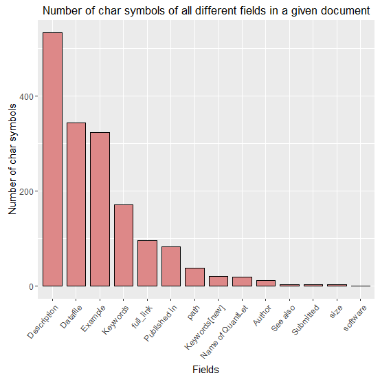
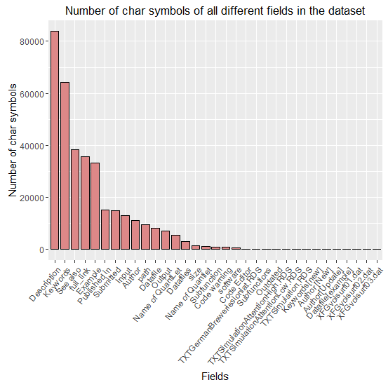

[](http://quantlet.de/index.php?p=info)

## [](http://quantlet.de/) **YAMLnumbchars** [](http://quantlet.de/d3/ia)

```yaml

Name of QuantLet : YAMLnumbchars

Published in : 'GitHub-API-Driven Clustering with 5-level Text Mining Validation Pipeline: R based
Approach'

Description : 'Plots the number of char symbols of all different fields in YAML text corpus
containing Quantnet metainfo.txt files.'

Keywords : plot, graphical representation, data visualization, text mining, statistics

See also : YAMLcleanmerge

Author : Anastasia Stepanchenko

Submitted : 04.07.2016 by Lukas Borke

Datafiles : yamlQN.RData

Example : 'Number of char symbols of all different fields in a given document, Number of char
symbols of all different fields in the dataset'

```






### R Code:
```r
# Clear variables and close windows
rm(list = ls(all = TRUE))
graphics.off()

# Install and load packages
libraries = c("ggplot2")
lapply(libraries, function(x) if (!(x %in% installed.packages())) {
install.packages(x)
})
lapply(libraries, library, quietly = TRUE, character.only = TRUE)

# Load data
options(stringsAsFactors=FALSE)
obj.names  = load("yamlQN.RData", .GlobalEnv)

yaml.DocNumChars = function(yaml_doc) {
  row_name    = names(yaml_doc)
  field_name  = c()
  field_nchar = c()
  
  for (i in 1:length(row_name)){
    field_name  = c(field_name,  row_name[i])
    field_nchar = c(field_nchar, nchar(yaml_doc[i]))
  }
  Field_nChars = data.frame(fields  = field_name, nchars  = field_nchar)
  Field_nChars = Field_nChars[order(-Field_nChars$nchars),]
  return (Field_nChars)
}

# Plot number of char symbols of all different fields in a given document
doc = 1
yaml.plotDocNumChars = function(yaml_doc) {
  Field_nChar = yaml.DocNumChars(yaml_doc)
  Field_nChar = transform(Field_nChar, fields = factor(fields, levels = Field_nChar$fields))
  
  plot = ggplot(data = Field_nChar, aes(x = fields, y = nchars, fill = fields)) + 
    geom_bar(colour = "black", fill = "#DD8888", width = .8, stat = "identity") + 
    guides(fill=FALSE) + xlab("Fields") + ylab("Number of char symbols") +
    ggtitle("Number of char symbols of all different fields in a given document") + theme(axis.text.x = element_text(angle = 50, hjust = 1))
  return(plot)
}

yaml.plotDocNumChars(yaml_list[[doc]])

yaml.NumChars = function(yaml_dset) {
  field_name  = c()
  field_nchar = c()
  for (i in 1:length(yaml_dset)){
    row_name  = names(yaml_dset[[i]])
    for (j in 1:length(row_name)){
      if(row_name[j] %in% field_name) {
        m     = match(row_name[j], field_name)
        field_nchar[m] = field_nchar[m] + nchar(yaml_dset[[i]][j])}
      else {
        field_name  = c(field_name,  row_name[j])
        field_nchar = c(field_nchar, nchar(yaml_dset[[i]][j]))}
    }
  }
  Field_nChars = data.frame(fields  = field_name, nchars  = field_nchar)
  Field_nChars = Field_nChars[order(-Field_nChars$nchars),]
  
  return (Field_nChars)
}

yaml.plotNumChars = function(yaml_dset){
  Field_nChar = yaml.NumChars(yaml_dset)
  Field_nChar = Field_nChar[order(-Field_nChar$nchars),]
  Field_nChar = transform(Field_nChar, fields = factor(fields, levels = Field_nChar$fields))
  
  plot = ggplot(data = Field_nChar, aes(x = fields, y = nchars, fill = fields)) + 
    geom_bar(colour = "black", fill = "#DD8888", width = .8, stat = "identity") + 
    guides(fill=FALSE) + xlab("Fields") + ylab("Number of char symbols") +
    ggtitle("Number of char symbols of all different fields in the dataset") + theme(axis.text.x = element_text(angle = 50, hjust = 1))
  return(plot)
}

# Plot number of char symbols of all different fields in the data set
yaml.plotNumChars(yaml_list)

```
