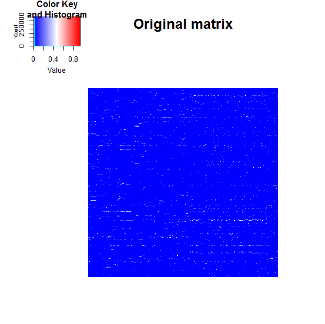

[](http://quantlet.de/index.php?p=info)

## [](http://quantlet.de/) **lsa_heatmaperr** [](http://quantlet.de/d3/ia)

```yaml

Name of QuantLet : lsa_heatmaperr

Published in : 'GitHub-API-Driven Clustering with 5-level Text Mining Validation Pipeline: R based
Approach'

Description : 'Plots heatmaps of the original matrix, the truncated matrix and the error matrix for
the LSA model of YAML text corpus.'

Keywords : 'plot, graphical representation, data visualization, heat-map, text mining, svd,
singular value'

See also : lsa_heatmapsvd, lsa_determineSign

Author : Lukas Borke, Anastasia Stepanchenko

Submitted : 04.07.2016 by Lukas Borke

Datafiles : YAML_lsa.RData

Example : 'heatmap of the original matrix, heatmap of the truncated matrix, heatmap of the error
matrix'

```




### R Code:
```r
# Clear all variables
rm(list = ls(all = TRUE))
graphics.off()

# Install and load packages
libraries = c("lsa", "gplots")
lapply(libraries, function(x) if (!(x %in% installed.packages())) {
  install.packages(x)
})
lapply(libraries, library, quietly = TRUE, character.only = TRUE)

# Load data
(obj.names  = load("YAML_lsa.RData", .GlobalEnv))

lsa.heatmapErr = function (space_matr){
    space = space_matr[[1]]
    m_a   = space_matr[[2]]
    m_lsa = as.textmatrix(space)
    m_lsa = as.matrix(m_lsa)
    fehler_matrix = m_a - m_lsa

    heatmap.2(main = "Original matrix", m_a, trace="none", revC = FALSE, dendrogram = "none", labRow = FALSE, labCol = FALSE, Rowv = FALSE, Colv = FALSE, breaks =100,col = bluered)
    dev.new()
    heatmap.2(main = "Truncated matrix", m_lsa, trace="none", revC = FALSE, dendrogram = "none", labRow = FALSE, labCol = FALSE, Rowv = FALSE, Colv = FALSE, breaks =100,col = bluered)
    dev.new()
    heatmap.2(main = "Error matrix", fehler_matrix, trace="none", revC = FALSE, dendrogram = "none", labRow = FALSE, labCol = FALSE, Rowv = FALSE, Colv = FALSE, breaks =100,col = bluered)
}

 # Plot
 lsa.heatmapErr(space_matr_auto)

```
