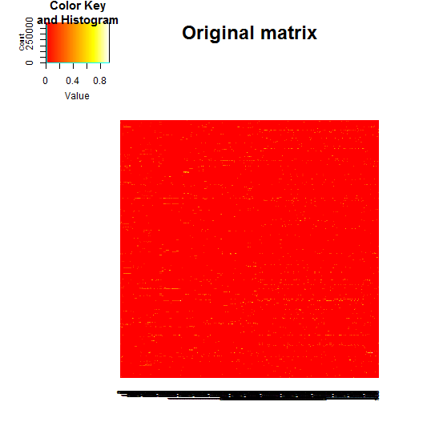
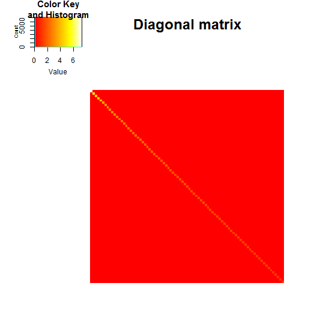
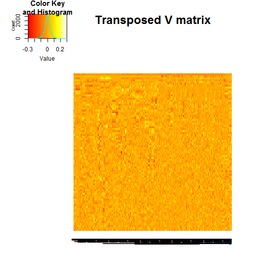
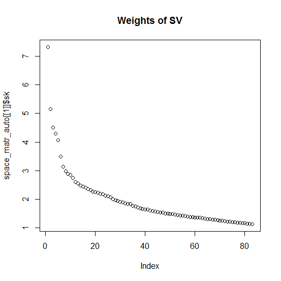

[](http://quantlet.de/index.php?p=info)

## [](http://quantlet.de/) **lsa_heatmapsvd** [](http://quantlet.de/d3/ia)

```yaml

Name of QuantLet : lsa_heatmapsvd

Published in : 'GitHub-API-Driven Clustering with 5-level Text Mining Validation Pipeline: R based
Approach'

Description : 'Plots heatmaps of the SVD components and weights of the singular values for the LSA
model of YAML text corpus.'

Keywords : 'plot, graphical representation, data visualization, heat-map, text mining, svd,
singular value'

See also : lsa_heatmaperr, lsa_determineSign

Author : Lukas Borke, Anastasia Stepanchenko

Submitted : 04.07.2016 by Lukas Borke

Datafiles : YAML_lsa.RData

Example : 'heatmap of the original matrix, heatmap of the U matrix, heatmap of the diagonal matrix,
heatmap of the transposed V matrix, weights of the singular values'

```











### R Code:
```r
# Clear all variables
rm(list = ls(all = TRUE))
graphics.off()

# Install and load packages
libraries = c("gplots")
lapply(libraries, function(x) if (!(x %in% installed.packages())) {
  install.packages(x)
})
lapply(libraries, library, quietly = TRUE, character.only = TRUE)

# Load data
(obj.names  = load("YAML_lsa.RData", .GlobalEnv))

lsa.heatmap = function (space_matr){
  
    space = space_matr[[1]]  
    m_a   = space_matr[[2]]
    U     = space$tk
    V     = space$dk  
    sv    = space$sk
    d_s   = diag(sv, length(sv), length(sv))
  
    dev.new()
    heatmap.2(main = "Original matrix", m_a, trace="none", revC = FALSE, dendrogram = "none", labRow = TRUE, labCol = TRUE, Rowv = FALSE, Colv = FALSE, breaks =100)
    dev.new()
    heatmap.2(main = "U matrix", U, trace="none", revC = FALSE, dendrogram = "none", labRow = TRUE, labCol = TRUE, Rowv = FALSE, Colv = FALSE, breaks =100)
    dev.new()
    heatmap.2(main = "Diagonal matrix", d_s, trace="none", revC = FALSE, dendrogram = "none", labRow = FALSE, labCol = FALSE, Rowv = FALSE, Colv = FALSE, breaks =100)
    dev.new()
    heatmap.2(main = "Transposed V matrix", t(V), trace="none", revC = FALSE, dendrogram = "none", labRow = TRUE, labCol = TRUE, Rowv = FALSE, Colv = FALSE, breaks =100)
 }
 
 # Plot
 lsa.heatmap(space_matr_auto)
 dev.new()
 plot(main = "Weights of SV", space_matr_auto[[1]]$sk)


```
